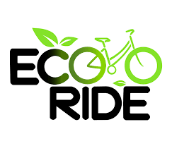

  

# 🚗 EcoRide — Smart Carpooling Platform 🌱

EcoRide is a smart and eco‑friendly carpooling platform designed to reduce traffic congestion, lower carbon emissions, and promote sustainable commuting through shared rides.

---

## 📌 Problem Statement

Urban transportation faces several challenges:
- Heavy traffic congestion  
- Increased fuel consumption  
- Rising carbon emissions  
- Inefficient use of private vehicles  

Most people commute alone, resulting in wasted vehicle capacity and environmental harm.

---

## 💡 Solution

EcoRide connects drivers and riders traveling on similar routes and schedules, enabling **efficient carpooling**.  
By sharing rides, users save money, reduce emissions, and contribute to greener cities.

---

## ✨ Features

- 🔐 User Authentication  
- 🏠 Personalized Dashboard  
- 🔍 Find Available Rides  
- ➕ Offer a Ride  
- 📊 Environmental Impact Tracking  
- 📱 Fully Responsive Design  
- 🌿 Sustainability‑focused Platform  

---

## 🛠️ Tech Stack

### Frontend
- React  
- TypeScript  
- Vite  
- React Router  
- Tailwind CSS  

### Libraries & Tools
- Lucide React (Icons)  
- Recharts (Charts & Analytics)  

